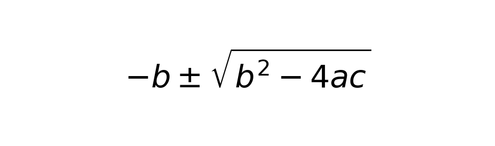
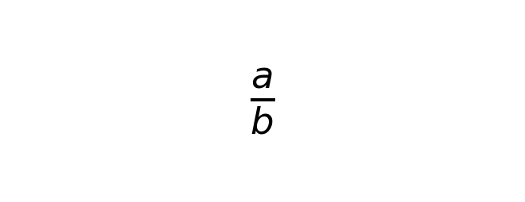
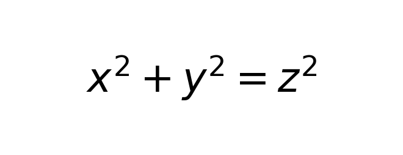
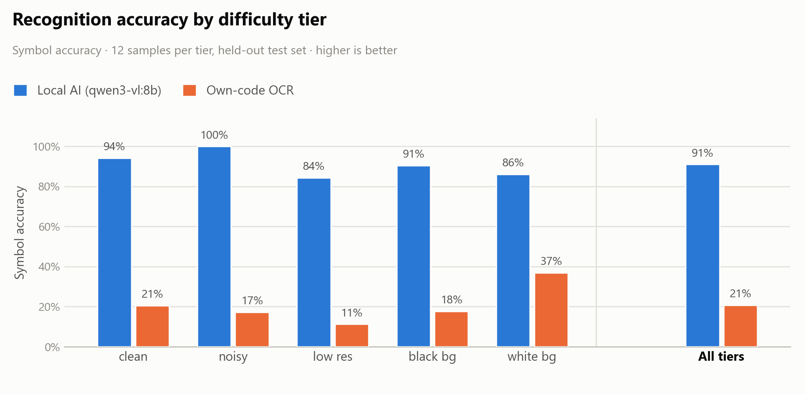
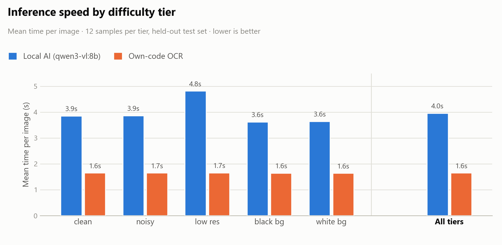

<div align="center">

# 📐 LaTeXOCR

**Convert images of math equations into real LaTeX, with two competing engines and a built-in benchmark.**

A Python tool that takes a photo or screenshot of a formula and returns editable **LaTeX**. It ships with **two recognition approaches** — a **local AI vision model** (Ollama `qwen3-vl:8b`) and a fully **hand-written OCR pipeline** (OpenCV + template matching) — and a **benchmark harness** that measures both on the same held-out test set so you can see which to use and when.

[](https://www.python.org/)
[](https://ollama.com/)
[](https://opencv.org/)
[](https://numpy.org/)
[](https://pytorch.org/)
[](LICENSE)

> Turn a picture of a formula into `\LaTeX{}` you can edit — and see exactly which engine is best for your input.

</div>

---

## 📖 Overview

**LaTeXOCR** reads an image that contains a rendered math expression and outputs a **valid LaTeX string**. It is built around two very different recognition engines:

1. **Local AI** — a vision-language model (`qwen3-vl:8b`) running locally via **Ollama**. It "sees" the image the way a person would and writes the LaTeX.
2. **Own-code OCR** — a hand-written computer-vision pipeline (no external AI) that segments glyphs, matches them against a symbol library with **OpenCV template matching** (optionally boosted by a small **PyTorch CNN**), and reconstructs the expression structure.

A shared **benchmark harness** runs both engines over the **same held-out test set** — split into five difficulty tiers (`clean`, `noisy`, `low_res`, `black_bg`, `white_bg`) — and produces accuracy, speed, and robustness numbers plus a Markdown/HTML report.

> ⚠️ **Data-integrity by design.** The dataset is split into **disjoint train/test sets**. The own-code pipeline trains only on the train split; the benchmark evaluates both engines **only** on the held-out test split — so the comparison is fair and never inflated by leakage.

---

## 🧪 Sample Conversions

Here is the **quadratic formula** rendered as an image and converted back to LaTeX by the local AI engine:



```latex
-b \pm \sqrt{b^2 - 4ac}
```

**Recognized:** `-b \pm \sqrt{b^2 - 4ac}` (ground truth `\frac{-b \pm \sqrt{b^2 - 4ac}}{2a}` — the AI captured the numerator exactly).

Here are two simpler expressions that **both** engines convert correctly, so you can compare them side by side:

| Input image | Ground truth | Local AI | Own-code OCR |
|---|---|---|---|
|  | `\frac{a}{b}` | `\frac{a}{b}` ✅ | `\frac{a}{b}` ✅ |
|  | `x^2 + y^2 = z^2` | `x^2 + y^2 = z^2` ✅ | `x^2+y^2=z^2` ✅ |

> 💡 **Result:** on clean, well-formed inputs both engines agree. The difference shows up on **degraded inputs** — see the benchmark below.

---

## 📊 Benchmark

Both engines were evaluated on a **sampled, held-out test set** (12 images per difficulty tier, 60 images total). The charts below show **recognition accuracy** and **inference speed** per tier, plus the aggregate across all tiers:

<p align="center">
  
</p>

<p align="center">
  
</p>

| Tier | AI — symbol acc. | Own-code — symbol acc. | AI — time | Own-code — time |
|---|---|---|---|---|
| `clean` | **94%** | 21% | 3.9s | **1.6s** |
| `noisy` | **100%** | 17% | 3.9s | **1.6s** |
| `low_res` | **84%** | 11% | 4.8s | **1.7s** |
| `black_bg` | **91%** | 18% | 3.6s | **1.6s** |
| `white_bg` | **86%** | 37% | 3.6s | **1.6s** |
| **Aggregate** | **91%** | **21%** | **3.96s** | **1.65s** |

> 📌 **Recommendation:** choose the **local AI engine** when **accuracy matters most** — it leads on every tier (91% vs 21% aggregate symbol accuracy). Choose the **own-code OCR engine** when **speed, offline operation, or minimal resource use** is the priority (2.4× faster, ~1.6s/image, no external model). For production correctness, the AI engine is the clear winner.

*Reproduce it:*

```bash
python benchmark_tiers.py 12 results/benchmark_tiers.json   # sample benchmark across all 5 tiers
python -m src.benchmark --limit 6                            # quick smoke run
python -m src.benchmark                                      # full held-out test set
```

---

## ✨ Features

- **Two recognition engines** — local AI vision model + hand-written OCR pipeline
- **`recognize <image>`** — convert a single image to LaTeX with either engine
- **Robust preprocessing** — Otsu binarization, denoising, deskew, auto-crop, and polarity normalization (handles white *and* black backgrounds)
- **Ground-truth dataset generator** — renders a curated set of expressions across **5 difficulty tiers**
- **Fair benchmarking** — disjoint train/test split, per-tier accuracy/speed/robustness, graceful handling when Ollama is offline
- **Automatic report** — Markdown + styled HTML comparing both engines with a clear recommendation
- **Full CLI** — `generate-dataset`, `preprocess`, `recognize`, `benchmark`, `report`, and `run-all`
- **233 passing tests** covering preprocessing, both recognizers, the benchmark, and the report

---

## 🧰 Tech Stack

| Layer | Technology |
|---|---|
| Language | Python 3.11+ |
| Local AI engine | Ollama `qwen3-vl:8b` (HTTP API) |
| Vision / image processing | OpenCV 4.9+, NumPy 1.26+, Pillow 10+ |
| Symbol rendering | matplotlib mathtext, SymPy |
| Symbol classification | OpenCV template matching + optional PyTorch CNN |
| Dataset / metrics | custom `dataset.py`, `metrics.py` |
| Testing | `pytest` (233 tests) |

---

## 📁 Repository Structure

```text
LaTeXOCR/
├── src/
│   ├── preprocess.py            # Shared image loading + preprocessing
│   ├── dataset.py               # Ground-truth generator (train/test split)
│   ├── metrics.py               # Levenshtein, symbol accuracy, timing, per-tier
│   ├── ai_recognizer.py         # Local AI engine (Ollama qwen3-vl:8b)
│   ├── owncode_recognizer.py    # Own-code OCR engine (OpenCV + CNN)
│   ├── symbols.py               # Symbol library / template rendering
│   ├── benchmark.py             # Benchmark harness (both engines, test set)
│   ├── report.py                # Markdown + HTML report generator
│   └── main.py                  # CLI entry point (full pipeline)
├── tests/                       # 233 pytest tests
├── samples/                     # Sample images + benchmark chart (used in README)
├── benchmark_tiers.py           # Per-tier benchmark for charting
├── make_charts.py               # Generates samples/benchmark_accuracy.png + benchmark_speed.png
├── requirements.txt             # Runtime dependencies
└── README.md                    # This file
```

---

## 🔨 Installation

### Requirements

| Component | Notes |
|---|---|
| Python | 3.11 or higher |
| Ollama | with `qwen3-vl:8b` pulled (`ollama pull qwen3-vl:8b`) — for the AI engine |

### Install dependencies

```bash
pip install -r requirements.txt
```

---

## 🚀 Usage

### Recognize a single image

```bash
# Use the local AI engine (default)
python -m src.main recognize path/to/equation.png --recognizer ai

# Use the hand-written OCR engine
python -m src.main recognize path/to/equation.png --recognizer owncode
```

### Generate the ground-truth dataset

```bash
python -m src.main generate-dataset
```

### Run the full benchmark (both engines, held-out test set)

```bash
python -m src.main benchmark
```

### Generate the comparison report

```bash
python -m src.main report        # writes report/report.md and report/report.html
```

### Run everything end-to-end

```bash
python -m src.main run-all
```

### Programmatic use

```python
from ai_recognizer import AIRecognizer
import owncode_recognizer as ocr

latex_ai = AIRecognizer().recognize("samples/quadratic.png")   # -> "-b \pm \sqrt{b^2 - 4ac}"
latex_oc = ocr.recognize("samples/frac.png")                   # -> "\frac{a}{b}"
```

---

## ⚙️ How it works

1. **Preprocess** — the image is loaded, converted to grayscale, binarized (Otsu),
   denoised, deskewed, auto-cropped, and normalized to a canonical height with
   consistent black-on-white polarity.
2. **Recognize** — the preprocessed (or raw) image goes to either:
   - **AI engine**: base64-encoded and sent to `qwen3-vl:8b` via Ollama's HTTP API
     with a tuned prompt; the raw output is cleaned into a single LaTeX line.
   - **Own-code engine**: glyphs are segmented via connected components, each glyph
     is classified by template matching (IoU over normalized 32×32), and a recursive
     layout parser reconstructs fractions, square roots, accents, and sub/superscripts.
3. **Benchmark** — both engines run over the held-out **test set**; metrics (exact
   match, Levenshtein similarity, symbol accuracy, timing, per-tier robustness) are
   computed with `metrics.py`.
4. **Report** — the results are turned into a readable Markdown and HTML report
   with a recommendation.

The dataset split is **deterministic** (seed 42, 70/30) and **disjoint**, so the
own-code pipeline's training never sees the benchmark's test images.

---

## 🧪 Running tests

```bash
python -m pytest tests/ -q
```

The suite covers preprocessing (incl. polarity and deskew regression guards), both
recognizers, the benchmark harness, the report generator, and the CLI.

---

## 📄 License

MIT

---

<div align="center">
  Made with ❤️ to turn pictures of math into editable LaTeX
</div>
